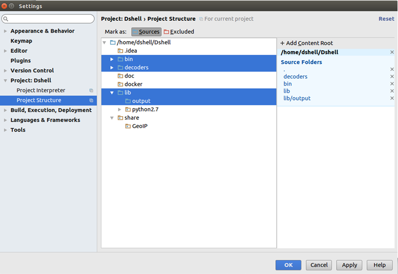
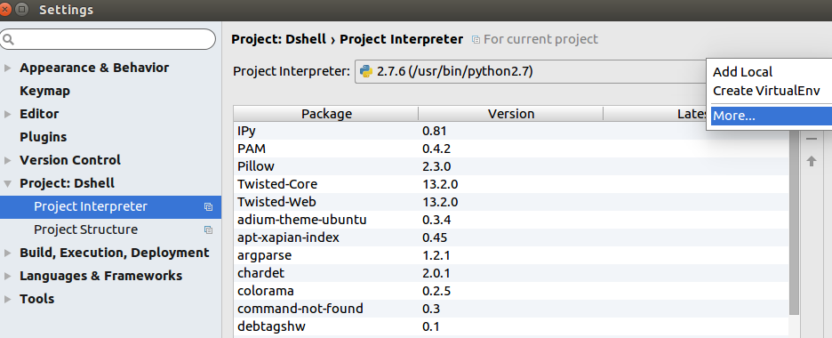
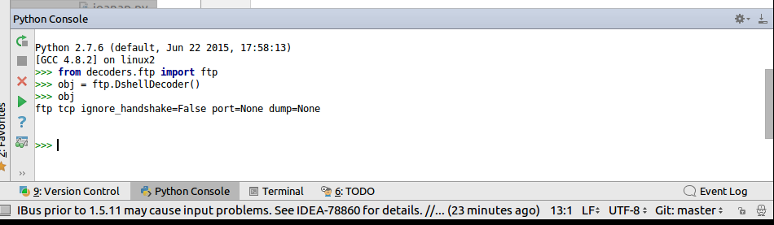
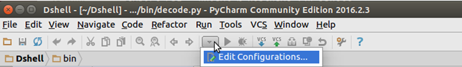
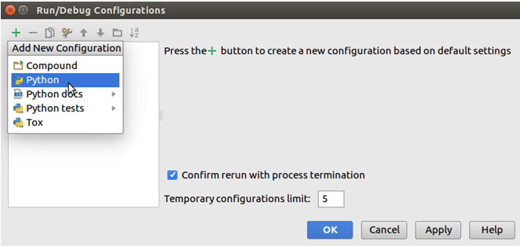
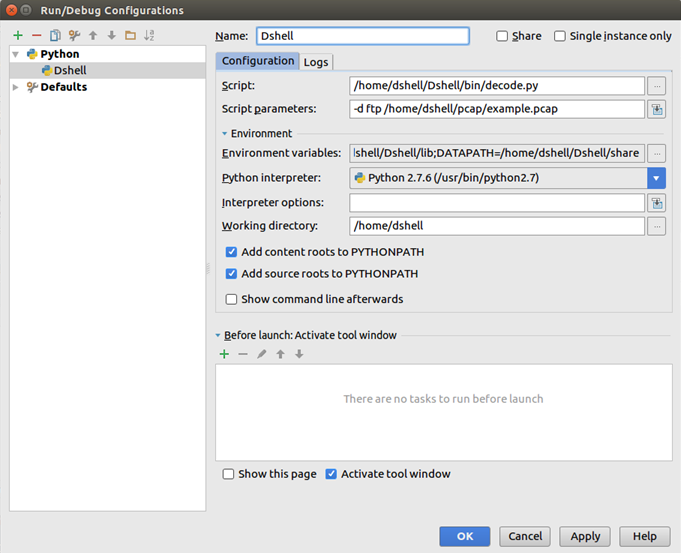
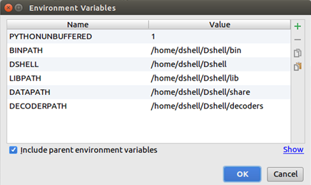
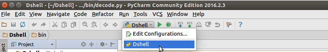
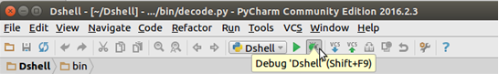

# Using DShell with PyCharm

This document will outline how Dshell decoders and the framework itself can be setup to allow development and
debugging within the Python IDE, PyCharm. If preferred, the concepts can likely be translated to other IDE’s and debugging environments.

After first installing all prerequistes mentioned in the [README](../README.md) and then opening the source repository
in Pycharm, the following needs to be done in order for PyCharm to correctly recognize the Dshell source code and executables.

## Settings

### Project Structure
In order to properly use PyCharm with Dshell, we need to tell it where to find the relevant Python files.
Under `File -> Settings -> Project: DShell -> Project Structure` set the folders `bin`, `decoders`, `lib`, and `lib/output`
as sources. Then click OK. After a few seconds, you should now see all the red underlines on imports disappear.

### Project Interpreter
We also need to tell the Python interpreter where to find the relevant files. This is useful if you want to import
Dshell modules within the interpreter. Under `File -> Settings -> Project: DShell -> Project Interpreter` click the
gear icon next to the dropdown with the project interpreter you are going to use, and then select `More…`

Then with your current Python interpreter highlighted, click the small folder tree icon (below the filter icon) to see a
window of `Interpreter Paths`. In this window click the `+` icon to the right and add the four folders added earlier
(`bin`, `decoders`, `lib`, and `lib/output`).

You should now be able to import decoders and other Dshell modules using the built in Python interpreter.

## Run Configurations
Run configurations in PyCharm allow a user to specify how to run tasks and programs. In the context of Dshell, a
configuration can be setup to specify which decoder to run, how to setup the environment variables needed by Dshell, and what working directory to use.

### Opening Configurations
The first step within PyCharm is to open up the interface to edit configurations. This can be done through the toolbar as
shown below or by using the menu to navigate to `Run -> Edit Configurations…`

### Adding a New Python Configuration for Dshell
Once the configurations interface is open, the next step is to add a new configuration. Since Dshell utilizes Python, a
Python configuration needs to be created. Select the `+` symbol near the top left and select `Python` in the drop down menu.

### Specifying the Configuration Details
Now that the configuration window is open, the following fields need to be populated:

- Script: The full path to the `decode.py` script in Dshell.
- Script parameters: The parameters that would be passed in when running the decode command.
- Environment  variables: The environment variables found in the `.dshellrc` file in Dshell’s root directory. This is detailed more below.
- Working directory: If all the settings use absolute paths, the working directory can be set to anything. Setting the working directory to a location where output files should be placed is a reasonable option.

### Specifying the Environment Variables
The environment variables in the configuration are important to mirror the Dshell shell.

When first running Dshell, some of the first steps are to build the project using make and to run the "dshell" script.
The build step is relevant here because it produces the `.dshellrc` file that the "dshell" script depends on to configure the shell’s environment.

For the PyCharm configuration, open up the `.dshellrc` file in Dshell’s directory and take a look at the environment
variables. Use these values to set the `Environment variables` field in the configuration.

### Save the Configuration
Now that the configuration has been setup, just give it a name and hit OK.

## Debugging

### Select Your Configuration
Before debugging, make sure the configuration you want is selected.

### Start Debugging
Once the configuration is set, make sure to set any breakpoints. Then, start up the debugger. Further details on how to use the debugger can be found online.

